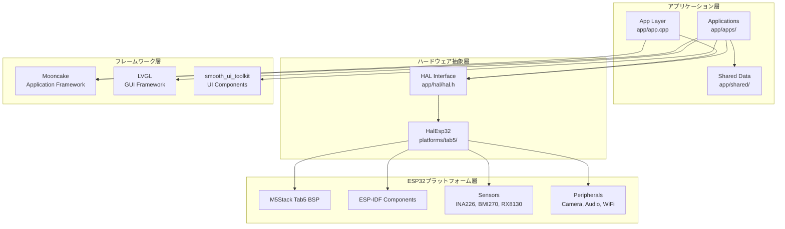
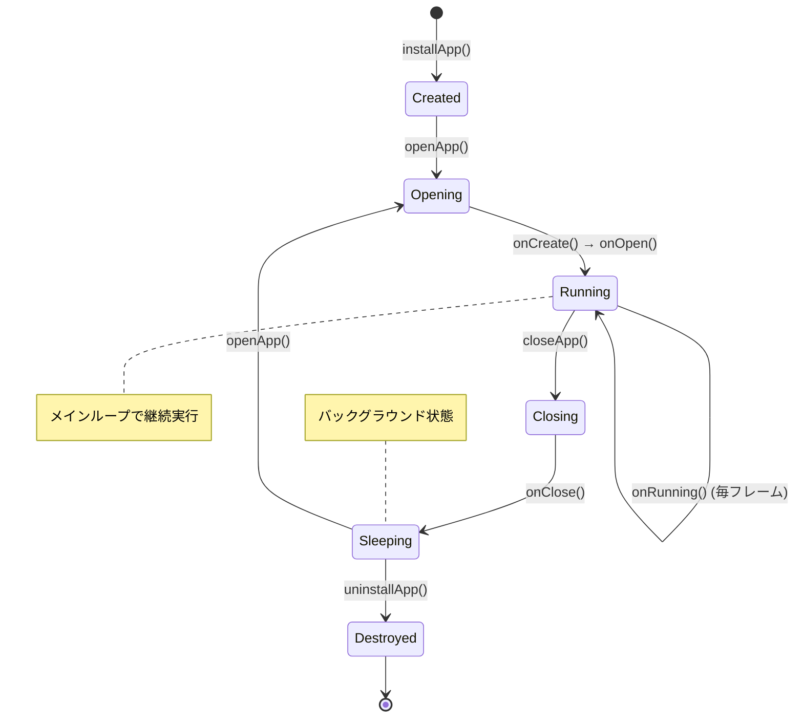
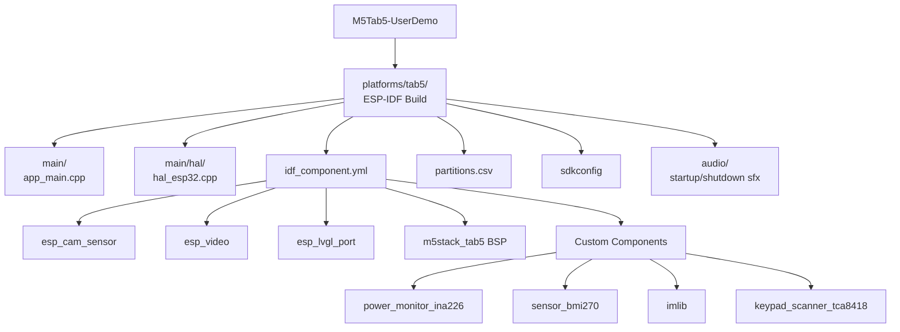

# M5Tab5-UserDemo アーキテクチャ解析書

## 目次
1. [プロジェクト概要](#プロジェクト概要)
2. [アーキテクチャ構成](#アーキテクチャ構成)
3. [処理フロー](#処理フロー)
4. [HAL層設計](#hal層設計)
5. [アプリケーション構成](#アプリケーション構成)
6. [コンポーネント分析](#コンポーネント分析)

## プロジェクト概要

M5Tab5-UserDemoは、M5Stack Tab5デバイス用のユーザーデモアプリケーションです。ESP32-S3をベースとしたTab5デバイスの各種機能をテストするための包括的なデモシステムです。

### 主要技術スタック
- **GUI**: LVGL（Light and Versatile Graphics Library）
- **フレームワーク**: Mooncake（独自アプリケーションフレームワーク）
- **UI Toolkit**: smooth_ui_toolkit（アニメーション対応UIコンポーネント）
- **プラットフォーム**: ESP-IDF v5.4.1
- **言語**: C++

## アーキテクチャ構成



## 処理フロー

### 1. システム起動フロー

```mermaid
flowchart TD
    START([Tab5デバイス起動])
    ESP32_MAIN[app_main関数実行<br/>platforms/tab5/main/app_main.cpp]
    
    INIT_CALLBACK[InitCallback設定]
    HAL_INJECTION[HAL Injection]
    ESP32_HAL[HalEsp32注入<br/>platforms/tab5/main/hal/hal_esp32.cpp]
    
    BSP_INIT[BSP初期化<br/>M5Stack Tab5 BSP]
    SENSOR_INIT[センサー初期化<br/>INA226, BMI270, RX8130]
    PERIPHERAL_INIT[周辺機器初期化<br/>Camera, Audio, WiFi]
    
    APP_INIT[app::Init実行]
    MOONCAKE_GET[GetMooncake取得]
    STARTUP_ANIM[起動アニメーション実行<br/>AppStartupAnim]
    INSTALL_APPS[アプリケーション登録<br/>AppLauncher]
    
    MAIN_LOOP[FreeRTOSメインループ開始]
    UPDATE[app::Update実行]
    MOONCAKE_UPDATE[Mooncake.update]
    LVGL_HANDLER[LVGL処理]
    TASK_DELAY[vTaskDelay(1)]
    
    DONE{アプリ終了?}
    DESTROY[app::Destroy]
    END([終了])
    
    START --> ESP32_MAIN
    ESP32_MAIN --> INIT_CALLBACK
    INIT_CALLBACK --> HAL_INJECTION
    HAL_INJECTION --> ESP32_HAL
    
    ESP32_HAL --> BSP_INIT
    BSP_INIT --> SENSOR_INIT
    SENSOR_INIT --> PERIPHERAL_INIT
    PERIPHERAL_INIT --> APP_INIT
    
    APP_INIT --> MOONCAKE_GET
    MOONCAKE_GET --> STARTUP_ANIM
    STARTUP_ANIM --> INSTALL_APPS
    INSTALL_APPS --> MAIN_LOOP
    
    MAIN_LOOP --> UPDATE
    UPDATE --> MOONCAKE_UPDATE
    MOONCAKE_UPDATE --> LVGL_HANDLER
    LVGL_HANDLER --> TASK_DELAY
    TASK_DELAY --> DONE
    
    DONE -->|No| MAIN_LOOP
    DONE -->|Yes| DESTROY
    DESTROY --> END
```

### 2. アプリケーションライフサイクル



## HAL層設計

HAL（Hardware Abstraction Layer）は、Tab5デバイスのハードウェア機能を抽象化し、アプリケーション層に統一されたインターフェースを提供します。

### HAL インターフェース構成

```mermaid
classDiagram
    class HalBase {
        <<abstract>>
        +type() string
        +init() void
        +delay(ms) void
        +millis() uint32_t
        +getCpuTemp() int
        
        // Display & Touch
        +getDisplayWidth() int
        +getDisplayHeight() int
        +setDisplayBrightness(brightness) void
        +getDisplayBrightness() uint8_t
        +lvglLock() void
        +lvglUnlock() void
        
        // Power Management
        +updatePowerMonitorData() void
        +setChargeQcEnable(enable) bool
        +setChargeEnable(enable) bool
        +setUsb5vEnable(enable) bool
        +setExt5vEnable(enable) bool
        +powerOff() void
        +sleepAndTouchWakeup() void
        +sleepAndShakeWakeup() void
        +sleepAndRtcWakeup() void
        
        // IMU
        +updateImuData() void
        +clearImuIrq() void
        
        // RTC
        +getRtcTime(time) void
        +setRtcTime(time) void
        +clearRtcIrq() void
        
        // Audio
        +setSpeakerVolume(volume) void
        +getSpeakerVolume() uint8_t
        +audioRecord(data, duration, gain) void
        +audioPlay(data, async) void
        +startDualMicRecordTest() void
        +startHeadphoneMicRecordTest() void
        +startPlayMusicTest() void
        +playStartupSfx() void
        +playShutdownSfx() void
        
        // Camera
        +startCameraCapture(canvas) void
        +stopCameraCapture() void
        +isCameraCapturing() bool
        
        // Network
        +setExtAntennaEnable(enable) void
        +getExtAntennaEnable() bool
        +startWifiAp() void
        
        // Storage & Interface
        +isSdCardMounted() bool
        +scanSdCard(dirPath) vector
        +usbCDetect() bool
        +usbADetect() bool
        +headPhoneDetect() bool
        +i2cScan(isInternal) vector
        +initPortAI2c() void
        +deinitPortAI2c() void
        
        // GPIO
        +gpioInitOutput(pin) void
        +gpioSetLevel(pin, level) void
        +gpioReset(pin) void
        
        // UART Monitor
        +uartMonitorSend(msg, newLine) void
    }
    
    class HalEsp32 {
        +type() "Tab5"
        +ina226 INA226
        +rx8130 RX8130_Class
        +lvDisp lv_disp_t*
        +lvKeyboard lv_indev_t*
        -_current_lcd_brightness uint8_t
        -_charge_qc_enable bool
        -_charge_enable bool
        -_ext_5v_enable bool
        -_usba_5v_enable bool
        -_ext_antenna_enable bool
        -_sd_card_mounted bool
        -set_gpio_output_capability() void
        -hid_init() void
        -rs485_init() void
        -wifi_init() bool
        -imu_init() void
        -update_system_time() void
    }
    
    HalBase <|-- HalEsp32
```



### Tab5デバイス機能マッピング

| 機能カテゴリ | ハードウェア | ESP-IDFコンポーネント | 実装場所 |
|-------------|-------------|---------------------|----------|
| **Display** | ILI9881C 1280x720 | esp_lvgl_port | BSP + HAL |
| **Touch** | タッチパネル | esp_lcd_touch | BSP + HAL |
| **Power Monitor** | INA226 | I2C Driver | HAL + ina226コンポーネント |
| **IMU** | BMI270 | I2C Driver | HAL + bmi270コンポーネント |
| **RTC** | RX8130 | I2C Driver | HAL + rx8130ユーティリティ |
| **Audio** | I2S Codec | I2S Driver | HAL |
| **Camera** | CSI/DVP | esp_cam_sensor, esp_video | HAL + ESPコンポーネント |
| **WiFi** | ESP32-S3内蔵 | ESP WiFi Driver | HAL |
| **Storage** | SD Card | SDMMC Driver | HAL |
| **USB** | USB-C/USB-A | USB Host/Device | HAL |
| **GPIO** | 拡張GPIO | GPIO Driver | HAL |
| **UART** | RS485 | UART Driver | HAL |

## アプリケーション構成

### 主要アプリケーション

1. **AppStartupAnim** (`app/apps/app_startup_anim/`)
   - 起動時のアニメーション表示
   - 一度実行後に自動終了

2. **AppLauncher** (`app/apps/app_launcher/`)
   - メインランチャーアプリケーション
   - 各種機能テストパネルを統合

3. **AppTemplate** (`app/apps/app_template/`)
   - 新規アプリ開発用のテンプレート

### AppLauncher パネル構成

```mermaid
graph LR
    subgraph "AppLauncher"
        LAUNCHER[LauncherView]
        
        LAUNCHER --> RTC[PanelRtc<br/>日時表示・設定]
        LAUNCHER --> LCD[PanelLcdBacklight<br/>画面輝度調整]
        LAUNCHER --> VOL[PanelSpeakerVolume<br/>音量調整]
        LAUNCHER --> PM[PanelPowerMonitor<br/>電力監視]
        LAUNCHER --> IMU[PanelImu<br/>IMUセンサー表示]
        LAUNCHER --> SW[PanelSwitches<br/>電源管理スイッチ]
        LAUNCHER --> POWER[PanelPower<br/>電源操作]
        LAUNCHER --> CAM[PanelCamera<br/>カメラテスト]
        LAUNCHER --> MIC[PanelDualMic<br/>デュアルマイクテスト]
        LAUNCHER --> HP[PanelHeadphone<br/>ヘッドフォンテスト]
        LAUNCHER --> SD[PanelSdCard<br/>SDカードスキャン]
        LAUNCHER --> I2C[PanelI2cScan<br/>I2Cデバイススキャン]
        LAUNCHER --> GPIO[PanelGpioTest<br/>GPIO制御テスト]
        LAUNCHER --> MUSIC[PanelMusic<br/>音楽再生テスト]
        LAUNCHER --> COM[PanelComMonitor<br/>シリアル通信監視]
    end
```



### パネル機能詳細

| パネル | 主要機能 | HAL依存機能 |
|--------|----------|-------------|
| **RTC** | 日時表示、RTC設定 | `getRtcTime()`, `setRtcTime()` |
| **LCD Backlight** | 輝度調整 | `setDisplayBrightness()` |
| **Speaker Volume** | 音量調整 | `setSpeakerVolume()` |
| **Power Monitor** | 電圧・電流・CPU温度表示 | `updatePowerMonitorData()`, `getCpuTemp()` |
| **IMU** | 加速度・ジャイロ表示 | `updateImuData()` |
| **Switches** | 電源管理、接続検知 | `setChargeEnable()`, `usbCDetect()` など |
| **Power** | 電源OFF、スリープ制御 | `powerOff()`, `sleepAndTouchWakeup()` など |
| **Camera** | カメラ映像表示 | `startCameraCapture()` |
| **Dual Mic** | デュアルマイク録音テスト | `startDualMicRecordTest()` |
| **Headphone** | ヘッドフォンマイクテスト | `startHeadphoneMicRecordTest()` |
| **SD Card** | ファイル一覧表示 | `scanSdCard()` |
| **I2C Scan** | I2Cデバイス検索 | `i2cScan()` |
| **GPIO Test** | GPIO制御テスト | `gpioSetLevel()` |
| **Music** | 音楽再生テスト | `startPlayMusicTest()` |
| **COM Monitor** | シリアル通信監視 | `uartMonitorSend()` |

## コンポーネント分析

### 1. Mooncakeフレームワーク
- アプリケーションのライフサイクル管理
- イベント駆動型アーキテクチャ
- アプリ間の状態管理

### 2. smooth_ui_toolkit
- LVGLベースのC++ラッパー
- アニメーション機能強化
- シグナル/スロット機能

### 3. 共有データ層 (Shared)
```cpp
struct SharedData_t {
    smooth_ui_toolkit::Signal<std::string> systemStateEvents;
    smooth_ui_toolkit::Signal<std::string> inputEvents;
};
```
- システム状態イベント管理
- 入力イベント配信
- スレッドセーフなデータ共有

### 4. プラットフォーム固有コンポーネント

#### ESP32プラットフォーム
- **BSP (Board Support Package)**: M5Stack Tab5固有の初期化
- **電力監視**: INA226による電圧・電流測定
- **IMU**: BMI270による6軸センサーデータ
- **RTC**: RX8130リアルタイムクロック
- **カメラ**: ESP32カメラセンサー対応
- **オーディオ**: I2S音声入出力

#### デスクトッププラットフォーム
- **SDL2**: ウィンドウ管理、イベント処理
- **シミュレーション**: センサーデータの模擬生成
- **ファイルシステム**: ネイティブファイル操作

### 5. ビルドシステム



### 6. ESP32-S3特有機能

Tab5デバイスはESP32-S3をベースとしており、以下の特徴を活用しています：

| 機能 | ESP32-S3の特徴 | Tab5での活用 |
|------|---------------|-------------|
| **デュアルコア** | Xtensa LX7 240MHz x2 | UI処理とバックグラウンド処理の分離 |
| **大容量メモリ** | 512KB SRAM + 外部PSRAM | LVGL描画バッファとアプリケーションデータ |
| **USB OTG** | USB 2.0 HS | USB-A/Cポートでのデバイス接続 |
| **CSI/DVP** | カメラインターフェース | 外部カメラモジュール対応 |
| **Wi-Fi 6** | 802.11 b/g/n/ax | 高速ワイヤレス通信 |
| **豊富なGPIO** | 45個のGPIO | 拡張ポートとセンサー接続 |

## まとめ

M5Tab5-UserDemoは、ESP32-S3をベースとしたTab5デバイス専用の包括的なデモシステムです：

### アーキテクチャの特徴
1. **ハードウェア特化設計**: Tab5デバイスの全機能を活用
2. **階層化アーキテクチャ**: HAL層による抽象化とモジュラー設計
3. **リアルタイム対応**: FreeRTOSベースの安定したタスク管理
4. **拡張性**: 新規パネル・アプリの容易な追加
5. **保守性**: 明確な責任分離と依存関係管理

### 技術的優位性
- **ESP-IDF v5.4.1**: 最新の開発フレームワーク活用
- **Mooncake**: 独自アプリケーションフレームワークによる柔軟性
- **LVGL**: 高性能GUI対応
- **豊富なセンサー統合**: 電力監視、IMU、RTCの統合制御
- **マルチメディア対応**: カメラ、オーディオの高度な制御

このアーキテクチャにより、Tab5デバイスの全機能を効率的にテストし、実用的なアプリケーション開発の基盤を提供しています。